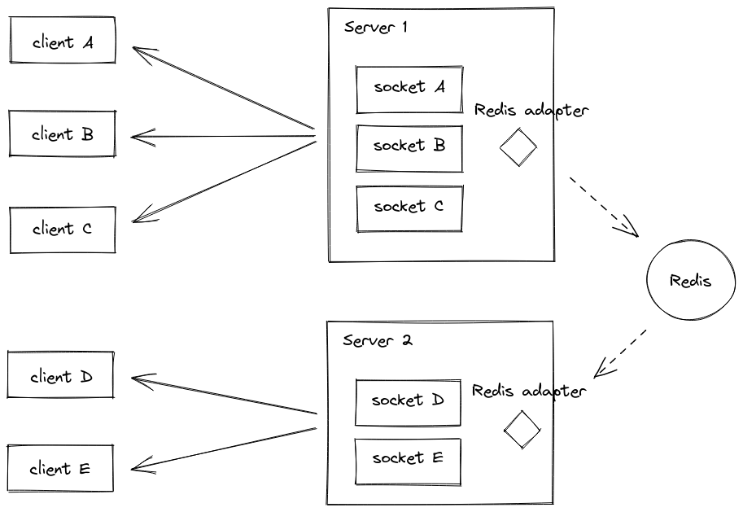

# **Redis Adapter (via Socket.io) in NestJS**



Mechanism :

- `redis-adapter` service subscribed `Redis`.
- `mock-client` service connect to `redis-adapter` service.
- `mock-emitter` service emitted message to `Redis`.
- `redis-adapter` service got message via **redis-adapter#/*** channel pattern from `Redis`.
- `redis-adapter` service emitting the message via Socket.io.
- `mock-client` got the message.

## **Usage**

Start compose with SSH key name `bitbucket` from Bitbucket :

```sh
sh run.local.sh bitbucket

# docker-compose -f docker-compose.local.yml up --build
```

Output : 

```sh
mock-emitter   | [Nest] 55  - MM/DD/YYYY, H:mm:ss PM     LOG Emitted (status: true) =>
mock-emitter   | [Nest] 55  - MM/DD/YYYY, H:mm:ss PM     LOG Object:
mock-emitter   | {
mock-emitter   |   "message": "YYYY-MM-DDTHH:mm:ss.zzzZ"
mock-emitter   | }
mock-emitter   |
redis-adapter  | [Nest] 53  - MM/DD/YYYY, H:mm:ss PM   DEBUG Emitting to client :
redis-adapter  | [Nest] 53  - MM/DD/YYYY, H:mm:ss PM   DEBUG Object:
redis-adapter  | {
redis-adapter  |   "namespace": "/nsp1",
redis-adapter  |   "rooms": "room1",
redis-adapter  |   "event": "time",
redis-adapter  |   "send": {
redis-adapter  |     "message": "YYYY-MM-DDTHH:mm:ss.zzzZ"
redis-adapter  |   }
redis-adapter  | }
redis-adapter  |
mock-client    | [ID: 3_S9Ydlk8BlfO9aPAAAE] Received message via "time": { message: 'YYYY-MM-DDTHH:mm:ss.zzzZ' }
```
